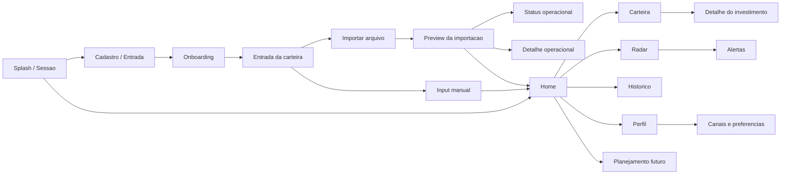

# Webapp estrutural do produto

## Objetivo desta entrega

Mapear o produto como webapp completo, navegavel em prototipo estrutural, sem design final.

Este documento usa como base:
- identidade visual ja definida em `docs/brand/*`
- jornadas e backlog em `docs/20_product/*`, `docs/product/*` e issues do GitHub
- backend atual do starter em `04_STARTER_BACKEND/esquilo_cloudflare_d1_starter`
- contratos em `services/api/openapi.yaml`
- schema em `database/d1/schema.sql`
- prototipos e wireframes em `apps/web/prototypes/*` e `apps/web/wireframes/*`

## Veredito executivo

O produto ja tem lastro suficiente para um webapp estrutural nas frentes abaixo:
- entrada e autenticacao
- onboarding e contexto
- home
- carteira
- detalhe de investimento
- importacao e revisao operacional
- historico
- radar
- perfil

O produto ainda nao tem lastro tecnico fechado para tratar como area pronta:
- alertas como modulo dedicado
- canais de notificacao
- metas e simuladores
- automacoes e operacao observavel fechada

## Mapa do produto final

## Shell principal do webapp

### Estrutura

- navegacao principal fixa
- barra superior com titulo da tela e acoes rapidas
- conteudo principal em leitura vertical
- rail contextual opcional apenas quando trouxer valor real

### Navegacao principal

- Home
- Carteira
- Importacoes
- Historico
- Radar
- Perfil

### Regras do shell

- a navegacao precisa continuar coerente se no futuro migrar para bottom nav no mobile
- o conteudo principal nao pode depender de tabela larga como unico formato
- acoes primarias precisam ficar no topo ou no fechamento natural do fluxo

## Mapa das telas

| Area | Tela | Papel no produto | Estado atual |
|---|---|---|---|
| Entrada | Splash e gate de sessao | validar sessao, saude e proxima rota | parcial |
| Entrada | Cadastro / entrada / recuperacao | abrir acesso sem friccao | parcial |
| Contexto | Onboarding financeiro | coletar realidade do usuario | parcial |
| Contexto | Entrada da carteira | decidir entre importar ou inserir manualmente | parcial |
| Leitura principal | Home | mostrar situacao, problema e proxima acao | parcial |
| Leitura principal | Carteira | listar holdings e abrir detalhe | parcial |
| Leitura principal | Detalhe do investimento | aprofundar leitura do ativo | parcial |
| Atualizacao | Central de importacoes | acompanhar historico operacional | parcial |
| Atualizacao | Importar arquivo | iniciar nova rodada | parcial |
| Atualizacao | Preview da importacao | revisar antes de persistir | parcial |
| Atualizacao | Status operacional do motor | acompanhar estado do processamento | parcial |
| Atualizacao | Detalhe operacional do processamento | ver erros, conflitos e baixa confianca | parcial |
| Atualizacao | Input manual | cadastrar posicao sem arquivo | sem evidencia suficiente |
| Leitura complementar | Historico | ver snapshots, eventos e tendencia | parcial |
| Leitura complementar | Radar | aprofundar score, problema e acao | parcial |
| Leitura complementar | Alertas | listar alertas e abrir contexto | sem evidencia suficiente |
| Leitura complementar | Perfil | revisar contexto, preferencias e saude | parcial |
| Leitura complementar | Canais e preferencias | controlar Telegram, email e frequencia | sem evidencia suficiente |
| Evolucao futura | Metas e simuladores | planejamento e comparadores | sem evidencia suficiente |

## Cobertura backend por tela

| Tela | Endpoints com evidencia | Leitura |
|---|---|---|
| Splash | `GET /v1/health`, `GET /v1/auth/session` | existe no starter, nao na trilha oficial `services/api` |
| Cadastro / entrada | `POST /v1/auth/register`, `POST /v1/auth/login`, `POST /v1/auth/recover`, `POST /v1/auth/logout` | existe no starter |
| Onboarding | `GET /v1/profile/context`, `PUT /v1/profile/context` | existe no starter |
| Entrada da carteira | `GET /v1/onboarding/portfolio-entry` | existe no starter, entrou com a PR `#9` |
| Home | `GET /v1/dashboard/home`, `GET /v1/analysis` | existe no starter |
| Carteira | `GET /v1/portfolio` | existe no starter |
| Detalhe do investimento | `GET /v1/portfolio/{portfolioId}/holdings/{holdingId}` | existe no starter |
| Central de importacoes | `GET /v1/history/imports` | existe no starter |
| Importar arquivo | `POST /v1/imports/start` | existe no starter |
| Preview da importacao | `GET /v1/imports/{importId}/preview`, `PATCH /v1/imports/{importId}/rows/{rowId}`, `POST /v1/imports/{importId}/rows/{rowId}/duplicate-resolution`, `POST /v1/imports/{importId}/commit` | existe no starter |
| Status operacional | `GET /v1/imports/{importId}/engine-status` | existe no starter, veio da Tela 11 |
| Detalhe operacional | `GET /v1/imports/{importId}/detail`, `GET /v1/imports/{importId}/conflicts` | existe no starter, veio da Tela 12 |
| Historico | `GET /v1/history/snapshots` | existe no starter |
| Radar | `GET /v1/analysis` | existe no starter, com apoio de modulos em `backend/modules` |
| Perfil | `GET /v1/profile/context`, `PUT /v1/profile/context`, `GET /v1/health` | existe no starter |
| Alertas | sem rota dedicada oficial | ainda nao ha modulo oficial dedicado |
| Canais e preferencias | sem rota dedicada oficial | ainda nao ha modulo oficial dedicado |
| Metas e simuladores | sem rota dedicada oficial | ainda nao ha modulo oficial dedicado |

## Cobertura banco por tela

| Tela | Tabelas principais | Status | Risco real |
|---|---|---|---|
| Splash e auth | `users` | conflitado | o starter depende de `auth_sessions`, ausente em `database/d1/schema.sql` |
| Onboarding e Perfil | `users`, `user_financial_context` | parcial | o contexto existe; sessao e portfolio principal nao batem com o schema oficial |
| Entrada da carteira | `user_financial_context`, `portfolios` | parcial | regra depende de sessao e portfolio principal |
| Home | `portfolio_snapshots`, `portfolio_snapshot_positions`, `portfolio_analyses`, `analysis_insights`, `user_financial_context` | parcial | a base de leitura existe, mas a autenticacao do starter nao bate com o schema oficial |
| Carteira | `portfolio_positions`, `assets`, `asset_types`, `platforms`, `portfolios` | parcial | o banco sustenta a leitura, mas a trilha de sessao continua conflitada |
| Detalhe do investimento | `portfolio_positions`, `assets`, `asset_types`, `platforms`, `portfolio_analyses` | parcial | leitura base existe; nao ha garantia fechada para todos os detalhamentos especificos |
| Importacoes | `imports`, `import_rows`, `assets`, `portfolio_positions`, `portfolio_snapshots`, `portfolio_snapshot_positions` | conflitado | o starter usa `assets.normalized_name`, `assets.is_custom` e outras dependencias nao refletidas no schema oficial |
| Historico | `portfolio_snapshots`, `portfolio_analyses`, `operational_events` | parcial | snapshots existem; trilha de eventos ainda nao esta fechada |
| Radar | `portfolio_analyses`, `analysis_insights`, `portfolio_snapshots`, `user_financial_context` | parcial | base analitica existe, mas alertas e historico de alertas nao estao fechados |
| Alertas | `analysis_insights`, `operational_events` | sem evidencia suficiente | nao existe persistencia fechada de envio, cooldown e historico |
| Canais e preferencias | nenhuma estrutura oficial suficiente | sem evidencia suficiente | faltam tabelas de configuracao de canais |
| Metas e simuladores | nenhuma estrutura oficial suficiente | sem evidencia suficiente | faltam tabelas de planejamento e simulacao |

## Risco estrutural que nao pode ser escondido

Hoje o banco oficial e o backend do starter nao estao completamente alinhados.

Evidencia objetiva:
- o starter usa `auth_sessions`
- o starter usa `portfolios.is_primary`
- o starter usa `assets.normalized_name`
- o starter usa `assets.is_custom`

Esses elementos nao aparecem em `database/d1/schema.sql`.

Conclusao:
- o banco atual sustenta boa parte do produto final navegavel em nivel conceitual
- ele ainda nao sustenta com confianca operacional toda a trilha integrada do starter

## Wirefront narrativo: regra de montagem

### Home
- titulo claro
- patrimonio, score e disponivel no topo
- problema principal antes da acao principal
- distribuicao em bloco de leitura rapida
- insights curtos
- atalhos para Carteira, Radar, Historico e Importacoes

### Carteira
- resumo acima
- filtros uteis no topo
- grupos por categoria
- holdings em linhas/cards expansivos
- acesso facil ao detalhe

### Detalhe
- cabecalho com nome, tipo e peso
- metricas principais
- bloco de sinais positivos
- bloco de sinais de atencao
- recomendacao associada
- links externos quando fizer sentido

### Importacoes
- tela de entrada simples
- preview como centro de confianca
- status operacional curto
- detalhe operacional para revisao profunda

### Radar
- score e breakdown
- alertas priorizados
- problema principal
- acao principal
- insights secundarios

### Historico
- linha do tempo
- snapshots
- badges de analise
- eventos relevantes

### Perfil
- contexto salvo
- preferencias
- saude do sistema
- canais quando existirem

## Plano de execucao das telas faltantes

1. Fechar shell, router e estados compartilhados
   - `UX-001`, `UX-003`, `TEC-038`, `TEC-039`
2. Consolidar auth e schema oficial
   - `TEC-004`, `TEC-032`
3. Integrar onboarding, perfil e entrada da carteira
   - `UX-004-UX-006`, `TEC-015`, `TEC-016`
4. Integrar Home, Carteira e Detalhe no app web
   - `UX-007-UX-024`, `TEC-009-TEC-014`, `TEC-040-TEC-042`
5. Integrar fluxo completo de importacao
   - `UX-025-UX-030`, `TEC-018-TEC-024`, `TEC-043`, `TEC-052`, `TEC-053`
6. Integrar Historico e Radar
   - `UX-034-UX-043`, `TEC-017`, `TEC-018`, `TEC-027-TEC-031`, `TEC-044`
7. Abrir alertas dedicados, canais e operacao
   - `US071-US074`, `TEC-033`, `TEC-047-TEC-049`
8. Deixar metas e simuladores para a segunda onda
   - `US055-US061`, `UX-044-UX-047`
